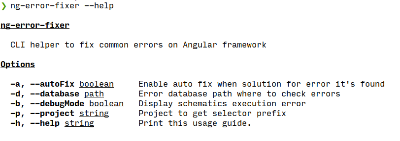

# ng-error-fixer

**Under development**

CLI helper to fix common errors on Angular framework



## Installation

```console
npm install -g ng-error-fixer
```

## Usage

1. Go to angular project.
2. Start development server + ng-error-fixer.

```console
npm run start 2>&1 | ng-error-fixer
```
3. Solution for error should be displayed on console.
4. Execute suggested solution.
5. Your code should be fixed. Enjoy it! :D
## CLI options
| command   	| alias 	| description                                        	|
|-----------	|-------	|----------------------------------------------------	|
| autoFix   	| a     	| Enable auto fix when solution for error it's found 	|
| database  	| d     	| Error database path where to check errors          	|
| debugMode 	| b     	| Display schematics execution error                 	|
| project   	| p     	| Project to get selector prefix                     	|
| help      	| h     	| Print usage guide.                                 	|


## Current fixes

- [unknown-html-schematics](https://github.com/LuisReinoso/unknown-html-schematics)

## Looking for contributions

This repo want to redirect from issues to fixes. In this way if you want to add any schematics to fix common Angular issues. Please on an issue on github.

## Acknowledgement

- Thanks to angular team and angular community for their awesome work.
- Thanks to [Harold](https://github.com/HaroldMaster). Which he start  develop this idea with me.

## License

Luis Reinoso [MIT license](LICENSE)
